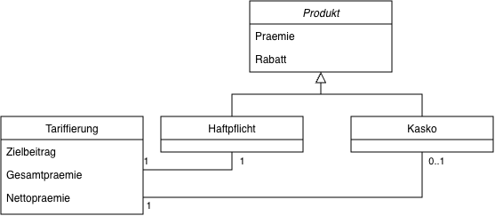

# Delegationsrechner – Coding Dojo

## Ziel
Erweiterung einer bestehenden Anwendung zur Berechnung von **KFZ-Tarifen** um ein Feature, das es ermöglicht, zu einem vorliegenden Verkaufsprodukt den **optimalen Rabatt** zu berechnen, um einen gewünschten **Zielbeitrag** zu erreichen.

In einer weiteren Ausbaustufe soll ein **Punktesystem** hinzukommen, das die Vergabe von Rabatten bewertet und deren Einfluss auf das Kontingent einzelner Makler abbildet.

---

## Fachlicher Hintergrund – KFZ-Versicherung

Die KFZ-Versicherung unseres Kunden **Pfefferminzia AG** deckt Risiken in Verbindung mit dem Fahrzeug des Versicherungsnehmers ab.

### Produktbausteine
- **Haftpflicht**
    - Obligatorisch für eine Tarifierung
    - Deckt durch den Versicherungsnehmer verursachte Schäden an fremdem Eigentum ab

- **Kasko**
    - Optional
    - Deckt Schäden am eigenen Fahrzeug ab
    - Unterscheidung in Voll- und Teilkasko wird hier der Einfachheit halber nicht weiter vorgenommen

---

## Domänenmodell

| Begriff | Beschreibung |
|----------|---------------|
| **Prämie** | Beitrag, der vom Versicherungsnehmer für dieses Verkaufsprodukt zu entrichten ist – konfiguriert durch das Tarifbuch |
| **Rabatt** | Anzuwendender Rabatt für dieses Verkaufsprodukt |
| **Gesamtprämie** | Summe der Prämien, die in der Tarifierung enthalten sind |
| **Nettoprämie** | Summe der Prämien nach Anwendung des Rabatts |
| **Zielbeitrag** | Gewünschte Nettoprämie, die der Makler erreichen möchte |

---

## Zielbeitrag – fachliche Motivation

Die Makler der **Pfefferminzia AG** sind Experten mit Marktkenntnis und Erfahrung, die einschätzen können, wie hoch eine effektiv zu zahlende Prämie für verschiedene Kunden sein sollte.

Daher soll der Tarifrechner die Möglichkeit bieten, einen **Zielbeitrag** anzugeben und automatisch die **anzuwendenden Rabatte** zu berechnen.

### Einschränkungen
- Prämien sind **immer positive Dezimalzahlen**
- Rabatte sind **immer nicht-negative ganze Zahlen**
- **Keine kostenfreien Produkte** – ein Rabatt darf **nicht ≥ 100 %** sein
- Es gibt Tarife, in denen die Haftpflicht-Prämie **höher oder niedriger** als die Kasko-Prämie ist
- Jeder Makler hat ein **begrenztes Rabattkontingent**, daher sollen Rabatte **möglichst gering** sein

---

## Unsere Aufgabe

Wir erweitern den bestehenden Tarifrechner um einen Algorithmus, der **iterativ die Rabatte** der übergebenen Produktbausteine berechnet, bis der gewünschte Zielbeitrag erreicht ist.

### Anforderungen an den Algorithmus
- **Toleranz:** ± 0.01 €
- **Maximale Iterationen:** 100
- **Sprache:** beliebig (freie Technologieauswahl)

---

## Repository

🔗 **GitHub:** [https://github.com/BAG-PawelBartoszek/kfz-tarifrechner.git](https://github.com/BAG-PawelBartoszek/kfz-tarifrechner.git)

---

## Lizenz

Dieses Projekt entstand im Rahmen eines **Coding Dojo** der **BROCKHAUS AG** und dient ausschließlich **zu Lern- und Übungszwecken**.
